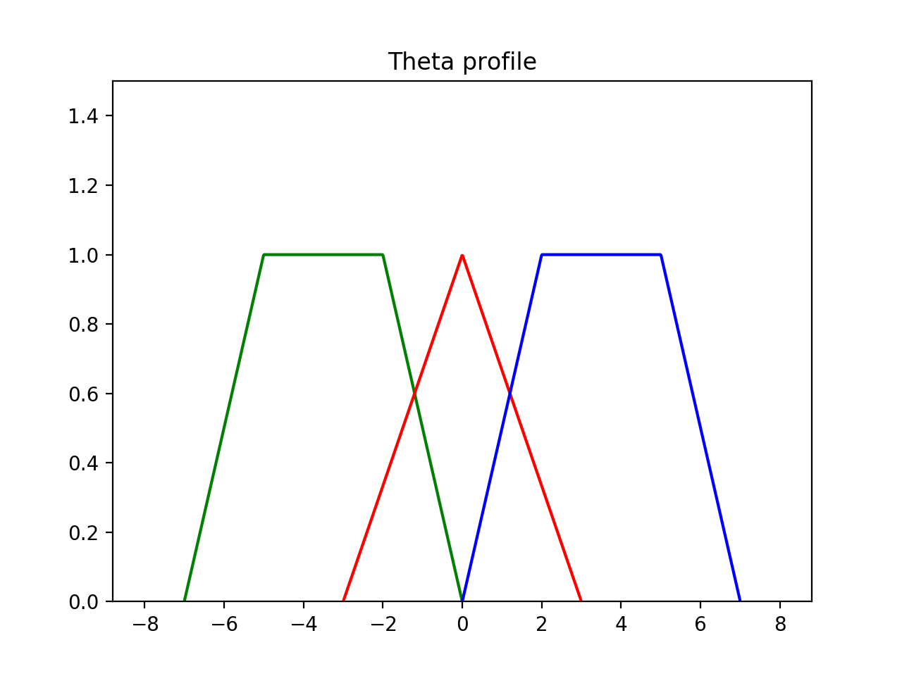
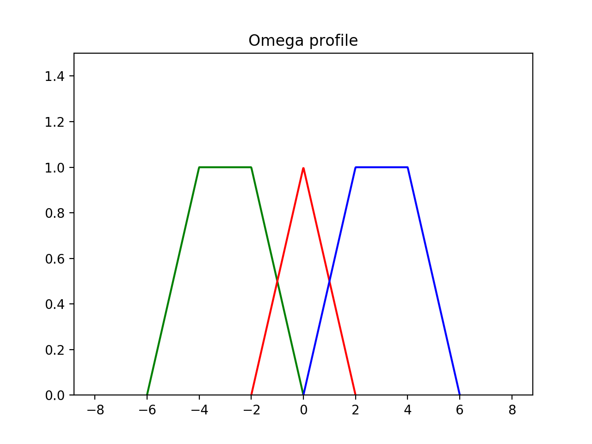
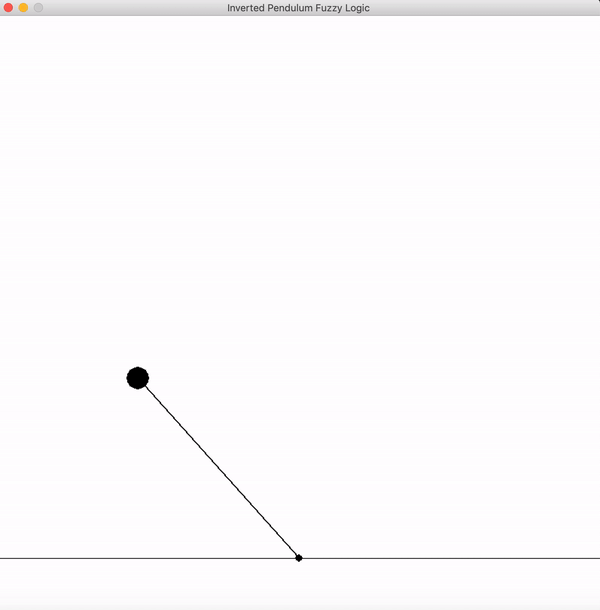

# Assignment 4

This assignment contains a program to control an inverted pendulum using Fuzzy Logic.

The profile for the Theta angle is as follows

The profile for the Omega is as follows

## Requirements
1. pygame
2. python3
3. matplotlib

## Sample Run

